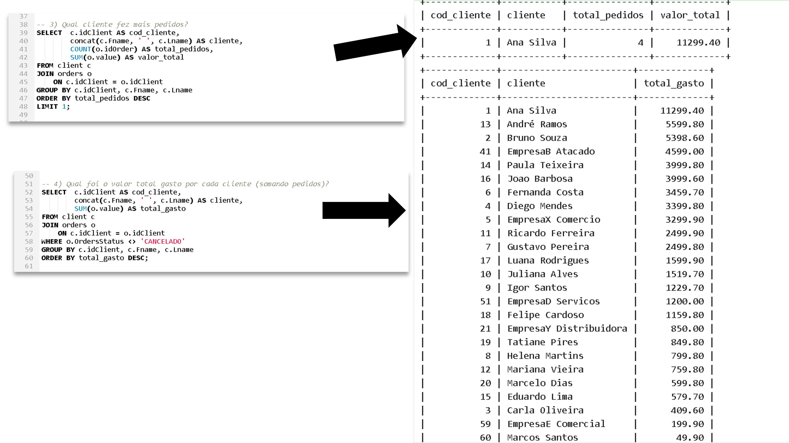
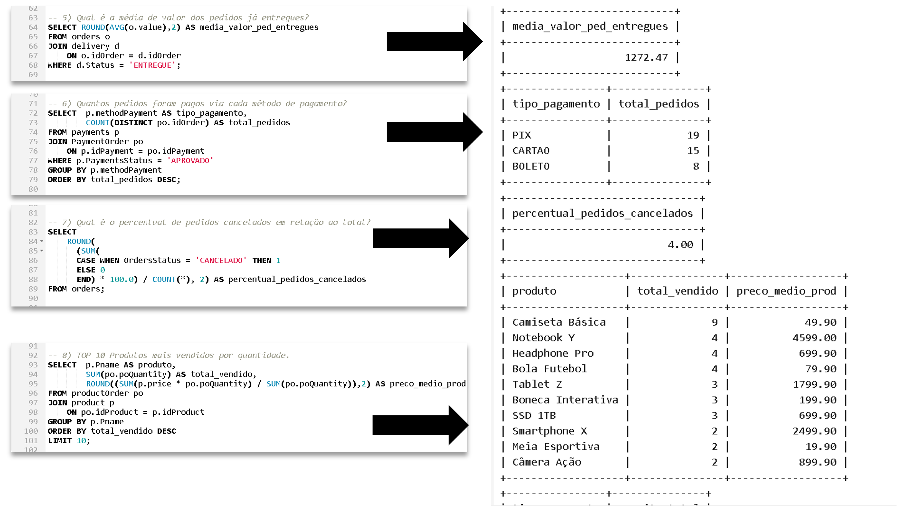

# Projeto: Banco de Dados Ecommerce 🛒

## Descrição do Projeto

Este projeto consiste na criação de um banco de dados para um **sistema de e-commerce**, com foco no controle de clientes, fornecedores, produtos, pedidos, pagamentos, estoque e entregas. O objetivo é fornecer uma base robusta para análises de negócios e testes de queries complexas em SQL.

O projeto foi desenvolvido com MySQL, incluindo a criação do **esquema lógico**, persistência de dados fictícios para testes e consultas que demonstram o uso de cláusulas SQL avançadas.

---

## Estrutura do Banco de Dados

O banco possui as seguintes tabelas principais:

- **client**: idclient, nome, dados pessoais e de contato, etc.  
- **supplier**: fornecedores, incluindo campo para CNPJ e endereço.  
- **product**: produtos comercializados, com categorias, dimensões, cor, peso e preço.  
- **orders**: pedidos realizados pelos clientes, com status, data e valor.  
- **productOrder**: itens de cada pedido, relacionando produtos e pedidos.  
- **payments**: formas de pagamento utilizadas.  
- **paymentOrder**: relação de pagamentos com os pedidos, incluindo parcelas e valores.  
- **storages** e **productStorage**: controle de estoque e quantidade por produto.  
- **ProductSupplier**: relacionamento de produtos com fornecedores e preços.  
- **seller** e **ProductSeller**: vendedores parceiros e os produtos que oferecem.  
- **Delivery**: status de entrega de cada pedido, com código de rastreio.

Todas as chaves primárias e estrangeiras foram definidas para garantir integridade referencial e consistência dos dados.

---

## Persistência de Dados

Foram inseridos dados fictícios para testes:

- **Clientes** com CPFs, CNPJs, endereços e telefones plausíveis.  
- **Fornecedores** com dados variados.  
- **Produtos** categorizados em `ELETRONICOS`, `VESTUARIO`, `MOVEIS` e `BRINQUEDOS`.  
- **Pedidos**, incluindo clientes que realizaram múltiplos pedidos.  
- **Pagamentos**, **estoque** e **entregas** associadas.

---

---

# Arquivos do Repositório

- `ecommerce_schemadata.sql` → script completo de criação do banco e tabelas, persistência de dados fictícios.  
- `ecommerce_queries.sql` → queries exemplares com SELECT, WHERE, JOIN, GROUP BY, HAVING, ORDER BY e atributos derivados.  
- `prints/` → imagens das saídas das queries para validação.


## Queries SQL Demonstrativo

### 1️⃣ Recuperação de informações (SELECT)
```sql
-- 1) Valor total da receita e unidades vendidas
SELECT  
    SUM(po.poQuantity) AS total_unidades_vendidas,
    SUM(po.poQuantity * o.value) AS receita_total,
    ROUND((SUM(po.poQuantity * o.value) / COUNT(DISTINCT o.idOrder)),2) AS ticket_medio
FROM productOrder po
JOIN orders o
    ON po.idOrder = o.idOrder
WHERE o.OrdersStatus <> 'CANCELADO';


-- 2) Receita total e unidades vendidas por categoria
SELECT  
    p.category AS categoria,
    SUM(po.poQuantity) AS total_unidades_vendidas,
    SUM(po.poQuantity * o.value) AS receita_total,
    ROUND(
        SUM(po.poQuantity * o.value) / 
        (SELECT SUM(po2.poQuantity * o2.value)
         FROM productOrder po2
         JOIN orders o2 ON po2.idOrder = o2.idOrder
         WHERE o2.OrdersStatus <> 'CANCELADO') * 100, 2
    ) AS representatividade
FROM product p
JOIN productOrder po
    ON po.idProduct = p.idProduct
JOIN orders o
    ON po.idOrder = o.idOrder
WHERE o.OrdersStatus <> 'CANCELADO'    
GROUP BY p.category
ORDER BY receita_total DESC;

```
---

**Observações**

* As queries demonstram seleção, filtros, junções, agrupamentos e atributos derivados.
* Podem ser usadas para responder perguntas de negócio, como:
  * Quao valor total da receita?
  * Qual receita por categoria e percentual sobre o total?
  * Qual é o percentual de pedidos cancelados?

Para validar as queries, consulte os prints abaixo:  





---

## Tecnologias Utilizadas


---

## Habilidades Desenvolvidas
- Modelagem de banco de dados relacional
- Criação de esquema lógico no MySQL
- Definição de chaves primárias, estrangeiras e constraints
- Escrita de queries SQL com SELECT, JOIN, WHERE, CASE WHEN, GROUP BY,  ORDER BY
- Geração de atributos derivados e métricas de negócio

## Dúvidas ou sugestões?
